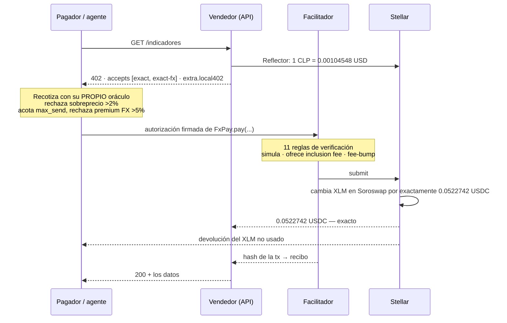

# Local402

**Cobra en pesos. Recibe USDC exacto.**

### [English](README.md) · Español

Local402 es [x402](https://x402.org) sobre Stellar para el resto del mundo: quien vende le pone precio a una
ruta de su API en su propia moneda — `"50 CLP"`, `"0.05 EUR"`, `"0.01 UF"` — y quien paga lo liquida con lo
que tenga: USDC, XLM o EURC. El vendedor siempre recibe el monto exacto en USDC, en una sola transacción,
sin que ninguna de las dos partes tenga que cambiar moneda a mano.

| | |
| --- | --- |
| Dashboard (testnet) | **<https://local402.vercel.app>** |
| API en vivo (Stellar mainnet) | **<https://local402-mainnet.vercel.app>** |
| Especificación del esquema | [`docs/scheme_exact_fx_stellar.md`](docs/scheme_exact_fx_stellar.md) |
| npm | [`local402-pricing`](https://www.npmjs.com/package/local402-pricing) · [`local402-fx`](https://www.npmjs.com/package/local402-fx) · [`local402-client`](https://www.npmjs.com/package/local402-client) · [`local402-server`](https://www.npmjs.com/package/local402-server) |
| FxPay en mainnet | [`CBMWKVMFEBBSN2VS7VD3AYNDLHAIPW4WYP5ZAOAEXKT4NCG2OPGYRSCV`](https://stellar.expert/explorer/public/contract/CBMWKVMFEBBSN2VS7VD3AYNDLHAIPW4WYP5ZAOAEXKT4NCG2OPGYRSCV) |
| Bug que encontramos y reportamos | [x402#3491](https://github.com/x402-foundation/x402/issues/3491) — mainnet rechaza la tarifa que ofrece el SDK |

---

## El problema

x402 permite que un recurso HTTP cobre por request y que un agente de IA pague por su cuenta. Pero hoy el
precio es un monto en dólares que se liquida con un solo activo. Escribe `price: "50 CLP"` y el SDK falla.

Así no funciona el comercio fuera de Estados Unidos. Una API chilena factura en pesos; una brasileña en
reales; un contrato de arriendo en Chile se denomina en **UF**, una unidad indexada a la inflación que
cambia todos los días. Y el cliente paga con lo que tenga en la billetera, que casi nunca es el activo del
vendedor.

## Qué agrega Local402

Dos capas independientes. Cualquiera de las dos sirve por sí sola.

**1. Precios en moneda local (`local402-pricing`, `local402-server`).**
El precio se queda en la moneda del vendedor. El oráculo on-chain [Reflector](https://reflector.network) lo
convierte a USDC en el momento del request, redondeando **hacia arriba** para que el vendedor nunca reciba
menos que el precio local. La cotización viaja dentro de la respuesta `402` estándar, en `extra.local402`, y
el requirement en sí es un `exact` en USDC común y corriente — **cualquier cliente x402 de Stellar que ya
exista lo paga sin cambiarle una línea.**

```ts
import { paymentMiddleware } from "@x402/express";
import { localRoute, local402Server } from "local402-server";

app.use(paymentMiddleware(
  { "GET /indicadores": localRoute("50 CLP", { payTo: SELLER_ADDRESS }) },
  local402Server(FACILITATOR_URL),
));
```

**2. `exact-fx`: pagar con otro activo (`local402-fx`, `contracts/fx-pay`).**
Un esquema x402 nuevo. Quien paga firma una llamada al contrato Soroban **FxPay**, que cambia sus XLM o EURC
en [Soroswap](https://soroswap.finance) por *exactamente* los USDC que pidió el vendedor, se los entrega, y
devuelve lo que sobró — todo de forma atómica. Si el swap no alcanza a entregar el monto exacto dentro del
límite del pagador, la transacción entera se revierte y no se mueve nada.

El vendedor nunca toca XLM. El facilitador paga la comisión de red. El pagador firma una sola vez.

## Para partir

```bash
npm install
npm run demo        # crea y fondea cuentas desechables de testnet, levanta todo
```

Después abre <http://localhost:3001>. La primera corrida escribe `.demo-keys.local` (está en el gitignore);
no hace falta nada más — ni visitar un faucet, ni configurar.

Para levantar las piezas por separado, copia cada `.env.example` y:

```bash
npm run facilitator   # :4022  liquida exact y exact-fx, paga las comisiones
npm run api           # :3001  vendedor de demo + dashboard
npm run agent         #        un cliente que paga
npm run mcp           #        servidor MCP: un agente descubre, cotiza y paga
```

## Cómo funciona un pago



## Mapa del repositorio

```
packages/
  pricing/   moneda local → USDC.  Oráculo Reflector, fuente de UF, DynamicPrice de x402
  fx/        el esquema exact-fx: cliente, resource server, facilitador, puja de comisiones
  client/    Local402Client — paga con USDC/XLM/EURC, con sus propias defensas. También CLI
  server/    localRoute() y localToolPayment() — una línea para ponerle precio a una ruta o a una tool MCP
apps/
  demo-api/      el vendedor: tres rutas pagadas, recibos, el dashboard
  facilitator/   verifica y liquida, paga comisiones, sirve el catálogo x402 Bazaar
  agent/         cliente pagador mínimo
  mcp/           servidor MCP que un agente de IA usa para descubrir, cotizar y pagar
  mcp-seller/    un servidor MCP cuya tool se cobra por llamada
contracts/
  fx-pay/        el contrato Soroban, en Rust, con sus tests
docs/
  scheme_exact_fx_stellar.md   la spec de exact-fx, en el formato de specs de x402
```

## Decisiones de diseño que vale la pena leer

Estos son los lugares donde la implementación obvia está mal.

**El redondeo tiene dirección.** `quoteLocalPrice` redondea *hacia arriba* (`ceilDiv`). Un vendedor que pide
50 CLP nunca puede recibir el equivalente a 49.999 CLP por un truncamiento de enteros.

**Las cotizaciones son la mediana de cinco, no el último precio.** El feed de CLP de Reflector ha publicado
prints individuales de 5 minutos a 0.65% de sus vecinos. `ReflectorFiatOracle` toma la mediana de los
últimos cinco registros, así que un tick atípico no puede fijar un precio. Las tasas rancias (>15 min por
defecto) se rechazan de plano.

**Las cotizaciones se firman con HMAC y quedan congeladas.** x402 reconstruye los payment requirements cuando
llega el reintento pagado — y el oráculo se pudo haber movido en el intertanto, lo que haría que el monto que
el pagador firmó ya no calce. `localPrice` firma la cotización que emitió; cualquier instancia del servidor
que tenga el mismo secreto la honra mientras siga vigente. Esto es lo que hace que el flujo sea correcto
detrás de un balanceador de carga, y no solo en un proceso.

**El cliente no confía en nadie.** `Local402Client` vuelve a derivar el precio desde su *propio* oráculo y
rechaza una cotización más de 2% por encima (`maxOverchargeBps`), y rechaza un pago FX cuyo `max_send` esté
más de 5% por sobre el valor de oráculo del precio (`maxFxPremiumBps`). La dirección del contrato FxPay está
fijada del lado del cliente y nunca se toma de la respuesta del servidor — un contrato malicioso podría
gastar hasta `max_send`.

**El presupuesto del agente se reserva, no se consulta.** `SpendingBudget` se debita *antes* del request y se
acredita de vuelta si falla, así que dos pagos concurrentes no pueden pasar ambos un check-then-spend y
juntos exceder el límite.

**El facilitador tiene once reglas de verificación, y dos son redundantes a propósito.** El árbol de
autorización (regla 7) ya acota lo que permite la firma del pagador. Las reglas 9 y 10 vuelven a revisar los
*eventos simulados* — que al vendedor le pagaron, y que ninguna cuenta del facilitador quedó vaciada — como
defensa en profundidad. Como el facilitador paga las comisiones, un despliegue público además puede exigir
vendedor en allowlist y monto mínimo, y limita la tasa de `verify` y `settle` por separado porque cuestan
cosas distintas.

**La puja de comisiones, y un bug que reportamos upstream.** `@x402/stellar` 2.25 siempre ofrece la comisión
base de 100 stroops, que mainnet rechaza seguido cuando Soroban está con surge pricing. `feeBumpSigner`
vuelve a envolver el fee bump con una puja del doble del p99 reciente de la red, con tope — sin tocar la
transacción interna ni sus firmas. Reportado upstream como
[x402#3491](https://github.com/x402-foundation/x402/issues/3491).

**La liquidación en paralelo necesita cuentas separadas.** Dos liquidaciones desde una misma cuenta Stellar
chocan en el número de secuencia. `ChannelPool` le entrega a cada liquidación concurrente su propia cuenta
pagadora de comisiones.

**La UF es una fecha, no una tasa.** Está definida por día calendario en la zona horaria de Chile.
`UfRateSource` lee del SII, cae a otras dos fuentes, se rinde a los 4 s y conserva el último valor conocido
hasta por tres días — porque una API que responde 402 sin precio es peor que una que cobra según la UF de
ayer.

**Un recurso pagado nunca se cachea.** Tanto el probe del cliente como la API mandan `no-store`. Un 200
cacheado entregaría gratis una respuesta pagada; un 402 cacheado entregaría una cotización vencida.

## Tests

```bash
npm test        # 27 tests unitarios entre pricing, fx y client
npm run typecheck
cd contracts && cargo test    # 8 tests del contrato contra un router Soroswap simulado
```

Los tests del contrato cubren lo que importa: entrega exacta con devolución de lo no usado, que `quote`
coincida con lo que `pay` gasta de verdad, rechazo cuando la ruta necesita más que `max_send`, ruteo por el
activo hub cuando no hay pool directa, elegir la más barata entre dos rutas, y negarse sin la autorización
del pagador.

Otros cuatro tests construyen un payload `exact-fx` real contra testnet y lo pasan por la verificación del
facilitador, incluyendo los rechazos. Solo corren cuando `FX_PAYER_SECRET` está definido, así que un
checkout limpio pasa en verde sin necesidad de una cuenta fondeada.

## Estado

Corriendo en **Stellar mainnet** con pagos reales — USDC, XLM y EURC — a través del despliegue de FxPay
enlazado más arriba. Cada venta deja un recibo que registra el precio local, la tasa y su fuente, el premium
del swap en puntos básicos, y el hash de la transacción. `GET /receipts.csv` se lo entrega a contabilidad.

`exact-fx` es un esquema en borrador. Está escrito en el formato de specs de x402 para poder discutirse como
propuesta, y se podría expresar igual de bien como un `assetTransferMethod` de `exact`; lo que no cambia en
ninguno de los dos casos es la garantía de cara al vendedor ni las reglas de verificación del facilitador.

## Licencia

MIT — ver [LICENSE](LICENSE).
