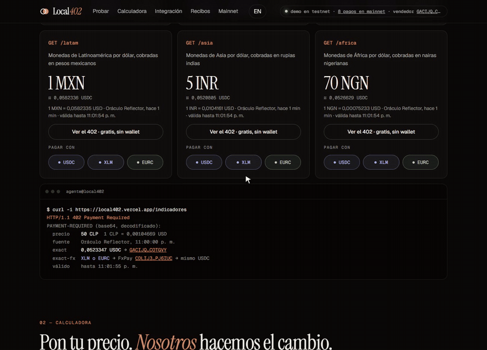
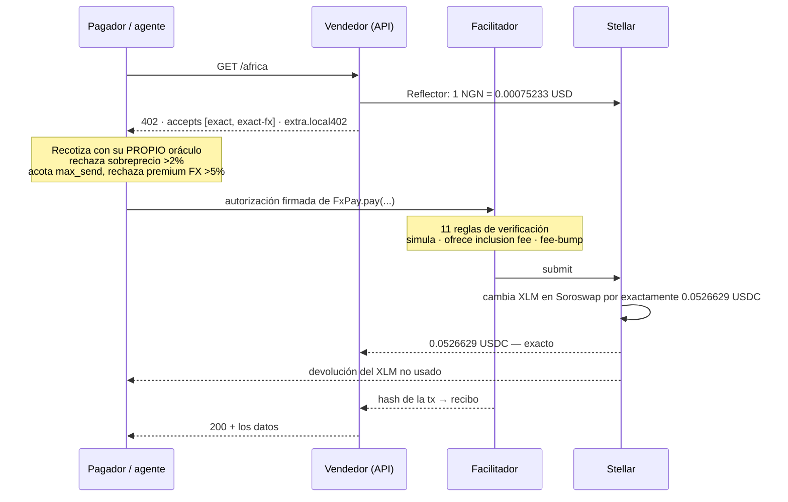

# Local402

**Cobra en tu moneda. Recibe USDC exacto.**

[](https://www.npmjs.com/package/local402-server)
[](https://local402-mainnet.vercel.app)
[](https://github.com/DiegoPoveda01/local402/actions/workflows/ci.yml)
[](#tests)
[](LICENSE)

### [English](README.md) · Español

Local402 es [x402](https://x402.org) sobre Stellar para el resto del mundo: quien vende le pone precio a una
ruta de su API en su propia moneda — `"1 MXN"`, `"5 INR"`, `"70 NGN"`, `"0.05 EUR"`, `"0.01 UF"` — y quien paga lo liquida con lo
que tenga: USDC, XLM o EURC. El vendedor siempre recibe el monto exacto en USDC, en una sola transacción,
sin que ninguna de las dos partes tenga que cambiar moneda a mano.



| | |
| --- | --- |
| Video demo (3 min) | **<https://youtu.be/SNeQ8wZo3hg>** |
| Dashboard (testnet) | **<https://local402.vercel.app>** |
| API en vivo (Stellar mainnet) | **<https://local402-mainnet.vercel.app>** |
| Especificación del esquema | [`docs/scheme_exact_fx_stellar.md`](docs/scheme_exact_fx_stellar.md) |
| npm | [`local402-pricing`](https://www.npmjs.com/package/local402-pricing) · [`local402-fx`](https://www.npmjs.com/package/local402-fx) · [`local402-client`](https://www.npmjs.com/package/local402-client) · [`local402-server`](https://www.npmjs.com/package/local402-server) |
| FxPay en mainnet | [`CA6Z4E55YN6LZEXBQPFCWUIMUJGAV42RLHYWWZ6SNIP4E73R2I2PUGHD`](https://stellar.expert/explorer/public/contract/CA6Z4E55YN6LZEXBQPFCWUIMUJGAV42RLHYWWZ6SNIP4E73R2I2PUGHD) |
| Build reproducible | [release](https://github.com/DiegoPoveda01/local402/releases/tag/v0.1.1_contracts_fx-pay_cli27.0.0) — wasm `69a12d89…`, byte por byte lo desplegado ([por qué no hay badge](#builds-reproducibles)) |
| Bug que encontramos y corregimos upstream | [x402#3491](https://github.com/x402-foundation/x402/issues/3491) — mainnet rechaza la tarifa que ofrece el SDK; nuestro arreglo, [x402#3503](https://github.com/x402-foundation/x402/pull/3503), ya está fusionado |

---

## El problema

x402 permite que un recurso HTTP cobre por request y que un agente de IA pague por su cuenta. Pero hoy el
precio es un monto en dólares que se liquida con un solo activo. Escribe `price: "70 NGN"` y el SDK falla.

Así no funciona el comercio fuera de Estados Unidos. Una API mexicana factura en pesos, una india en
rupias, una nigeriana en nairas; un contrato de arriendo en Chile se denomina en **UF**, una unidad
indexada a la inflación que cambia todos los días. Y el cliente paga con lo que tenga en la billetera, que
casi nunca es el activo del vendedor.

### Dónde funciona hoy

Local402 cobra en cualquier moneda que el oráculo fiat de [Reflector](https://reflector.network) publique
en mainnet (revisado el 2026-09-16), además de USD y la UF:

| Región | Monedas |
| --- | --- |
| Latinoamérica | MXN, BRL, COP, PEN, ARS, CLP, CRC, VES |
| África | NGN, KES, ZAR, CDF |
| Asia | INR, JPY, CNY, KRW, PHP, HKD |
| Europa y Norteamérica | EUR, GBP, TRY, RUB, CAD |

Una moneda nueva no requiere código: el día que Reflector la publique, `localRoute("… XYZ")` ya cobra en
ella. La demo vende una ruta por región (`/latam` en MXN, `/asia` en INR, `/africa` en NGN) junto a las de
euros y de Chile. Chile es el ejemplo más completo por la UF, que muestra que incluso una unidad indexada,
que no es una moneda, funciona igual.

## Qué agrega Local402

Dos capas independientes. Cualquiera de las dos sirve por sí sola.

**1. Precios en moneda local (`local402-pricing`, `local402-server`).**
El precio se queda en la moneda del vendedor. El oráculo on-chain [Reflector](https://reflector.network) lo
convierte a USDC en el momento del request, redondeando **hacia arriba** para que el vendedor nunca reciba
menos que el precio local. La cotización viaja dentro de la respuesta `402` estándar, en `extra.local402`, y
el requirement en sí es un `exact` en USDC común y corriente — **cualquier cliente x402 de Stellar que ya
exista lo paga sin cambiarle una línea.**

```ts
import { paymentMiddleware } from "@x402/express";
import { localRoute, local402Server } from "local402-server";

app.use(paymentMiddleware(
  { "GET /africa": localRoute("70 NGN", { payTo: SELLER_ADDRESS }) },
  local402Server(FACILITATOR_URL),
));
```

**2. `exact-fx`: pagar con otro activo (`local402-fx`, `contracts/fx-pay`).**
Un esquema x402 nuevo. Quien paga firma una llamada al contrato Soroban **FxPay**, que cambia sus XLM o EURC
en [Soroswap](https://soroswap.finance) por *exactamente* los USDC que pidió el vendedor, se los entrega, y
devuelve lo que sobró — todo de forma atómica. Si el swap no alcanza a entregar el monto exacto dentro del
límite del pagador, la transacción entera se revierte y no se mueve nada.

El vendedor nunca toca XLM. El facilitador paga la comisión de red. El pagador firma una sola vez.

## En qué se diferencia de x402 en Stellar hoy

La [documentación de x402 de Stellar](https://developers.stellar.org/docs/build/agentic-payments/x402) admite
cualquier token SEP-41, USDC por defecto, a través del facilitador de Coinbase (testnet) y el plugin de
OpenZeppelin Relayer. Los dos liquidan el esquema `exact` de x402: el precio es un monto de un token, y quien
paga transfiere ese mismo token. Los proyectos x402 en Stellar que encontramos en los directorios del
ecosistema y en hackathons anteriores (revisado el 2026-09-22) — facilitadores, plantillas MCP, paywalls, SDKs
para agentes — se construyen sobre ese mismo esquema.

| | x402 en Stellar hoy | Local402 |
| --- | --- | --- |
| El precio se escribe en | un monto del token de liquidación | la moneda del vendedor — CLP, UF, NGN, EUR… — convertida por Reflector en el momento del request |
| Quien paga usa | el token del vendedor | USDC, XLM o EURC; FxPay hace el swap dentro del pago |
| El vendedor recibe | ese token | el monto exacto en USDC, o la transacción se revierte |
| Un cliente x402 común | paga | sigue pagando: cada 402 mantiene una opción `exact` normal junto a `exact-fx` |

Local402 no reemplaza a un facilitador ni hace un fork de x402. Son cuatro paquetes npm y un contrato encima, y el
único cambio que necesitó upstream — la oferta de comisión — volvió al propio x402.

## Dónde lo usarías

Cada caso de abajo corre sobre el código de este repositorio, no sobre una hoja de ruta.

- **Una API tarificada en tu propia moneda.** Cobras `70 NGN` o `50 CLP`; al comprador se
  le cobra eso y tú recibes USDC. Nunca publicas una cifra en dólares ni cargas el tipo de
  cambio en tu página de precios — `local402-server` es una línea sobre cualquier ruta x402.
- **Agentes que pagan a agentes.** El servidor MCP expone cada ruta como una herramienta; un
  agente lee el `402`, lo cotiza contra su propio oráculo y paga por llamada con el activo que
  tenga. Sin suscripción, sin cuenta, sin humano en el medio.
- **Pago por petición en vez de un plan.** Un pago liquidado cuesta unos 0,0024 XLM de comisión
  de red (medido, más abajo). Eso hace que una sola llamada, un solo artículo o una sola
  inferencia valgan la pena cobrarse por separado.
- **Que el pagador traiga su propio activo.** Con `exact-fx` el comprador paga en XLM o EURC y
  tú igual recibes el USDC exacto que pediste — el swap y la devolución ocurren dentro del pago.
  Un paso menos de "primero consigue USDC" entre el comprador y la venta.
- **Facturar en una unidad que no es moneda.** La UF está cableada igual que un código fiat, así
  que un arriendo o un contrato indexado a la inflación se puede tarificar en la unidad en que
  realmente está escrito.
- **Contabilidad que se cuadra sola.** Cada venta deja un recibo con el precio local, la tasa y
  su fuente, el premio del swap en puntos básicos y el hash de la transacción.
  `GET /receipts.csv` le entrega a contabilidad un libro mayor, no una captura de pantalla.

## Pruébalo en 60 segundos

Sin instalar nada, sin billetera, sin llave. Pídele algo a la API de mainnet y lee lo que responde:

```bash
# El 402 en sí: el precio está en nairas, el requirement en USDC
curl -si https://local402-mainnet.vercel.app/africa \
  | grep -i '^payment-required' | cut -d' ' -f2 | tr -d '\r' | base64 -d

# Lo mismo con el cliente publicado, que vuelve a derivar el precio desde su propio oráculo
npx -y local402-client quote https://local402-mainnet.vercel.app/africa
npx -y local402-client quote https://local402-mainnet.vercel.app/asia --with XLM
npx -y local402-client quote https://local402-mainnet.vercel.app/uf --with EURC
```

Para pagar de verdad, usa el botón de Freighter en la sección 08 del [dashboard](https://local402.vercel.app), o
`STELLAR_SECRET=S… npx -y local402-client pay <url> --with XLM --max "100 NGN"`. El límite `--max` puede ir en
cualquier moneda soportada, sea o no la del vendedor, y el cliente rechaza cualquier cosa por encima.

## Para partir

```bash
npm install
npm run demo        # crea y fondea cuentas desechables de testnet, levanta todo
```

Después abre <http://localhost:3001>. La primera corrida escribe `.demo-keys.local` (está en el gitignore);
no hace falta nada más — ni visitar un faucet, ni configurar.

Para levantar las piezas por separado, copia cada `.env.example` y:

```bash
npm run facilitator   # :4022  liquida exact y exact-fx, paga las comisiones
npm run api           # :3001  vendedor de demo + dashboard
npm run agent         #        un cliente que paga
npm run mcp           #        servidor MCP: un agente descubre, cotiza y paga
```

## Cómo funciona un pago



## Medido, no estimado

Once pagos reales en Stellar mainnet entre el 15 y el 20 de septiembre de 2026, todos exitosos. Los tres
últimos pasaron por el despliegue reproducible. Los más recientes
están en los [recibos](https://local402-mainnet.vercel.app/receipts).

| | |
| --- | --- |
| Lo que recibió el vendedor | El monto exacto en USDC que pedía el 402, en los once pagos. |
| Comisión de red, pagada por el facilitador | 0.0024 XLM en un pago con USDC. En `exact-fx`, 0.081 y 0.044 XLM en los dos primeros swaps de un despliegue nuevo, y cerca de 0.0055 una vez que las entradas del contrato están en caliente. Al redesplegar se repitió igual: 0.0807 y 0.0436. |
| Lo que el swap gastó de verdad | 0.21–0.39% por sobre el valor Reflector del precio (los tres pagos del 15 de septiembre). |
| Lo máximo que autorizó el pagador | 2.29–3.17% por sobre ese valor. Eso incluye el margen de slippage de 2%, y lo que el swap no usa se devuelve. |
| Un 402 con cotización en vivo | Cerca de 0.41 s, en caliente. |
| Un pago completo en testnet: 402 → cotización → firma → liquidación → 200 | 5.6 s con XLM, 6.8 s con USDC, 9.4 s con EURC (que rutea por XLM). |

## Mapa del repositorio

```
packages/
  pricing/   moneda local → USDC.  Oráculo Reflector, fuente de UF, DynamicPrice de x402
  fx/        el esquema exact-fx: cliente, resource server, facilitador, puja de comisiones
  client/    Local402Client — paga con USDC/XLM/EURC, con sus propias defensas. También CLI
  server/    localRoute() y localToolPayment() — una línea para ponerle precio a una ruta o a una tool MCP
apps/
  demo-api/      el vendedor: seis rutas pagadas, recibos, el dashboard
  facilitator/   verifica y liquida, paga comisiones, sirve el catálogo x402 Bazaar
  agent/         cliente pagador mínimo
  mcp/           servidor MCP que un agente de IA usa para descubrir, cotizar y pagar
  mcp-seller/    un servidor MCP cuya tool se cobra por llamada
contracts/
  fx-pay/        el contrato Soroban, en Rust, con sus tests
docs/
  scheme_exact_fx_stellar.md   la spec de exact-fx, en el formato de specs de x402
```

## Decisiones de diseño que vale la pena leer

Estos son los lugares donde la implementación obvia está mal.

**El redondeo tiene dirección.** `quoteLocalPrice` redondea *hacia arriba* (`ceilDiv`). Un vendedor que pide
70 NGN nunca puede recibir el equivalente a 69.999 NGN por un truncamiento de enteros.

**Las cotizaciones son la mediana de cinco, no el último precio.** El feed de CLP de Reflector ha publicado
prints individuales de 5 minutos a 0.65% de sus vecinos. `ReflectorFiatOracle` toma la mediana de los
últimos cinco registros, así que un tick atípico no puede fijar un precio. Las tasas rancias (>15 min por
defecto) se rechazan de plano. Si al feed le faltaron períodos, primero se corta el historial en el hueco
(`recentRun`): si no, esos cinco registros abarcan horas mientras siguen reportando el timestamp más
nuevo, y la mediana termina promediando precios que ya no vienen al caso. Un precio respaldado por un solo
registro lo dice, con el sufijo `#single` en su fuente — eso es un print crudo, justo el tick que la
mediana existe para absorber.

**Las cotizaciones se firman con HMAC y quedan congeladas.** x402 reconstruye los payment requirements cuando
llega el reintento pagado — y el oráculo se pudo haber movido en el intertanto, lo que haría que el monto que
el pagador firmó ya no calce. `localPrice` firma la cotización que emitió; cualquier instancia del servidor
que tenga el mismo secreto la honra mientras siga vigente. Esto es lo que hace que el flujo sea correcto
detrás de un balanceador de carga, y no solo en un proceso.

**El cliente vuelve a derivar el precio en vez de creerle.** `Local402Client` cotiza el mismo precio local
desde su propio oráculo y rechaza una cotización más de 2% por encima (`maxOverchargeBps`), y rechaza un
pago FX cuyo `max_send` esté más de 5% por sobre el valor de oráculo del precio (`maxFxPremiumBps`). La
dirección del contrato FxPay está fijada del lado del cliente y nunca se toma de la respuesta del
servidor — un contrato malicioso podría gastar hasta `max_send`.

Vale la pena ser preciso con lo que eso compra: por defecto ambos lados leen el *mismo* feed de Reflector,
así que esto atrapa a un vendedor que cotiza mal, no a un feed que está equivocado. Pásale tu propio
`oracle` a `Local402Client` para una lectura independiente. La UF agrega una segunda dependencia
compartida — el SII, o sus dos espejos — y una UF rancia es la razón de que la cotización además lleve
`oracleValueDate`: el día del que realmente viene el valor, que el timestamp del CLP no puede decirte.

**El presupuesto del agente se reserva, no se consulta.** `SpendingBudget` se debita *antes* del request y se
acredita de vuelta si falla, así que dos pagos concurrentes no pueden pasar ambos un check-then-spend y
juntos exceder el límite.

**El facilitador tiene once reglas de verificación, y dos son redundantes a propósito.** El árbol de
autorización (regla 7) ya acota lo que permite la firma del pagador. Las reglas 9 y 10 vuelven a revisar los
*eventos simulados* — que al vendedor le pagaron, y que ninguna cuenta del facilitador quedó vaciada — como
defensa en profundidad. Como el facilitador paga las comisiones, un despliegue público además puede exigir
vendedor en allowlist y monto mínimo, y limita la tasa de `verify` y `settle` por separado porque cuestan
cosas distintas.

**La puja de comisiones, y un bug que corregimos upstream.** `@x402/stellar` 2.25 siempre ofrece la comisión
base de 100 stroops, que mainnet rechaza seguido cuando Soroban está con surge pricing. `feeBumpSigner`
vuelve a envolver el fee bump con una puja del doble del p99 reciente de la red, con tope — sin tocar la
transacción interna ni sus firmas. Lo reportamos como
[x402#3491](https://github.com/x402-foundation/x402/issues/3491) y lo corregimos en
[x402#3503](https://github.com/x402-foundation/x402/pull/3503), ya fusionado en `main` de x402: el
facilitador exact ahora acepta la opción `inclusionFeeStroops`. El workaround se queda hasta que una
versión posterior a la 2.26.0 lo publique.

**La liquidación en paralelo necesita cuentas separadas.** Dos liquidaciones desde una misma cuenta Stellar
chocan en el número de secuencia. `ChannelPool` le entrega a cada liquidación concurrente su propia cuenta
pagadora de comisiones, y encola las demás hasta que se libere una. Es un lock en proceso, así que solo
separa liquidaciones que corren en la *misma* instancia del facilitador: dos instancias que comparten una
llave siguen chocando. Por eso `/settle` reintenta una vez ante un `submission_failed` que nunca llegó al
ledger, y por eso un facilitador escalado horizontalmente necesita `FACILITATOR_PRIVATE_KEYS` disjuntas
por instancia.

**La UF es una fecha, no una tasa.** Está definida por día calendario en la zona horaria de Chile.
`UfRateSource` lee del SII, cae a otras dos fuentes, se rinde a los 4 s y conserva el último valor conocido
hasta por tres días — porque una API que responde 402 sin precio es peor que una que cobra según la UF de
ayer.

**Un recurso pagado nunca se cachea.** Tanto el probe del cliente como la API mandan `no-store`. Un 200
cacheado entregaría gratis una respuesta pagada; un 402 cacheado entregaría una cotización vencida.

## Cuando algo sale mal

Cada uno de estos casos falla antes de que se mueva un peso, o revierte la transacción completa. Los códigos
del facilitador de abajo van sin su prefijo `invalid_exact_fx_payload_`.

| Situación | Qué pasa |
| --- | --- |
| La tasa del oráculo tiene más de 15 minutos, viene fechada en el futuro o es cero | El servidor se niega a cotizar. No se emite requirement, así que nadie paga con un precio malo. |
| El vendedor cotiza más de 2% por sobre el oráculo propio del pagador | `Local402Client` se niega antes de firmar. |
| El swap podría gastar más de 5% por sobre el valor del oráculo | El cliente se niega antes de firmar (`maxFxPremiumBps`). |
| El pagador no tiene `max_send` | El cliente dice cuánto tiene que haber disponible y cuánto hay, antes de abrir la billetera. |
| Las pools se movieron y la ruta ahora necesita más que `max_send` | FxPay revierte con `ExcessiveInput`. No se mueve nada. |
| Ninguna pool puede entregar el activo del vendedor | FxPay falla con `NoRoute`, un error legible en vez de un trap. |
| El monto, el destinatario o el activo no calzan con el 402 | El facilitador lo rechaza: `wrong_amount`, `wrong_recipient`, `wrong_asset`. |
| La firma autoriza algo más que `pay` y una transferencia | `wrong_auth_root`, `wrong_auth_subinvocation` o `unexpected_auth_entries`. |
| La transacción movería fondos del propio facilitador | `moves_facilitator_funds`, revisado contra los eventos simulados. |
| El plazo vence mientras el pagador aprueba en la billetera | `deadline_expired`. El cliente ya da 180 s para firmar. |
| Dos liquidaciones compiten por una cuenta | `ChannelPool` le da a cada una la suya. Un envío que nunca llegó al ledger se reintenta una vez. |
| Las tres fuentes de la UF están caídas | Se usa la última UF conocida hasta por tres días. Después solo deja de cotizar la ruta en UF; las demás siguen funcionando. |

## Desplegarlo en algo real

`npm run demo` no necesita nada. Un despliegue servido por más de un proceso, o que gasta plata de verdad,
necesita esto — cada `.env.example` lista el resto.

| Variable | Dónde | Por qué importa |
| --- | --- | --- |
| `LOCAL402_QUOTE_SECRET` | vendedor | Firma las cotizaciones. Sin esto, un reintento pagado que cae en otra instancia vuelve a cotizar y rechaza un pago que el pagador ya firmó. El mismo valor en todas las instancias. El servidor avisa por consola cuando falta. |
| `KV_REST_API_URL`, `KV_REST_API_TOKEN` | vendedor | Recibos, los topes de pagos de demo y el último valor conocido de la UF. Sin esto cada instancia serverless guarda los suyos, y desaparecen con ella. |
| `SELF_URL` | vendedor | Dónde compra el agente de demo. Cae al dominio de producción del proyecto en Vercel, y al `Host` del request solo si es localhost, porque el `Host` lo escribe quien llama. |
| `CORS_ORIGIN` | vendedor | Orígenes del dashboard autorizados a pagar desde la billetera del visitante, separados por coma. |
| `PAY_TO_ALLOWLIST`, `MIN_AMOUNT` | facilitador | Cada liquidación gasta las comisiones del propio facilitador. En `stellar:pubnet` estos vienen por defecto en `PAY_TO` y 100000 (0.01 USDC); ponlos explícitos para atender a otros vendedores. |
| `FACILITATOR_PRIVATE_KEYS` | facilitador | Una llave por liquidación concurrente. `ChannelPool` las separa solo dentro de una instancia, así que dale a cada instancia las suyas. |
| `FX_CONTRACT` | ambos | Obligatorio en mainnet: el despliegue de FxPay al que queda fijada la autorización del pagador. |

## Tests

```bash
npm test        # 41 tests unitarios entre pricing, fx y client
npm run typecheck
cd contracts && cargo test    # 11 tests del contrato contra un router Soroswap simulado
```

Los tests del contrato cubren lo que importa: entrega exacta con devolución de lo no usado, que `quote`
coincida con lo que `pay` gasta de verdad, rechazo cuando la ruta necesita más que `max_send`, ruteo por el
activo hub cuando no hay pool directa, elegir la más barata entre dos rutas, y negarse sin la autorización
del pagador. Dos cubren un router que responde sin montos: la ruta por el hub gana igual si existe, y si no
el pagador recibe `NoRoute` en vez de un trap. El último es un test de propiedades: 200 combinaciones
deterministas de pools, montos y límites, y en cada una comprueba que el vendedor recibe exactamente
`dest_amount`, que el pagador gasta exactamente la ruta más barata, que FxPay no se queda con nada, y que un
`max_send` por debajo de la ruta no mueve nada.

Nueve tests de TypeScript pasan la verificación del facilitador sin red, por cada rechazo al que llega antes
de tocar la red: un payload de otra versión, esquema o red, una transacción que no puede leer, una llamada
que no es el `pay` de FxPay, un origen o un pagador que es el propio facilitador, un activo de envío que no
acepta, un activo, monto o destinatario distinto del que pidió el vendedor, y un deadline vencido o
demasiado lejano.

Otros cuatro tests construyen un payload `exact-fx` real contra testnet y lo pasan por la verificación del
facilitador, incluyendo los rechazos. Solo corren cuando `FX_PAYER_SECRET` está definido, así que un
checkout limpio pasa en verde sin necesidad de una cuenta fondeada.

## Builds reproducibles

El contrato en mainnet no es una compilación local que alguien subió. Su wasm es, byte por byte, un
artefacto de release de GitHub compilado en CI por el
[workflow reutilizable de stellar-expert](https://github.com/stellar-expert/soroban-build-workflow).
Compruébalo sin fiarte de este README:

```bash
curl -fsSL -O https://github.com/DiegoPoveda01/local402/releases/download/v0.1.1_contracts_fx-pay_cli27.0.0/fx-pay_v0.1.1.wasm
sha256sum fx-pay_v0.1.1.wasm
curl -s https://api.stellar.expert/explorer/public/contract/CA6Z4E55YN6LZEXBQPFCWUIMUJGAV42RLHYWWZ6SNIP4E73R2I2PUGHD | jq -r .wasm
```

Los dos imprimen `69a12d89059be04ac195f5acf40982d7e9ee93fd08f4df33626789d00ffccbd2`. El build es
reproducible en sentido estricto: dos corridas, desde commits distintos y con la versión del paquete
cambiada entre medio, produjeron artefactos idénticos. Cada uno lleva una
[atestación de procedencia SLSA](https://github.com/DiegoPoveda01/local402/attestations) firmada vía
Sigstore y registrada en Rekor. `scripts/mainnet/deploy-fxpay.sh` despliega el artefacto descargado del
release y aborta si su hash no es el de arriba, así que una compilación local no puede llegar a mainnet
por descuido.

stellar.expert sigue reportando el contrato como `unverified`, y esa parte no está en nuestras manos. Su
endpoint de ingreso responde `{}` donde antes respondía `{"ok":1}`, así que los envíos nunca llegan a la
cola de validación — reenviar el payload de un contrato ya verificado reproduce el fallo, lo que descarta
cualquier cosa propia de este build. Está reportado aguas arriba en
[soroban-build-workflow#9](https://github.com/stellar-expert/soroban-build-workflow/issues/9) y
[#8](https://github.com/stellar-expert/soroban-build-workflow/issues/8), donde el release de otro proyecto
lleva más de un mes sin verificar. Los dos hashes de arriba son exactamente la comprobación que ese badge
habría automatizado.

## Lo que no hace

- **No hace que el oráculo tenga la razón.** Por defecto el vendedor y el pagador leen el mismo feed de
  Reflector, así que Local402 atrapa a un vendedor que cotiza mal, no a un feed que está equivocado. Pásale
  tu propio `oracle` a `Local402Client` para una lectura independiente.
- **No cubre el riesgo cambiario.** El vendedor recibe USDC. Pasarlo a su moneda local sigue siendo cosa suya: Local402
  fija el monto de la venta, no el tipo de cambio de después.
- **No busca en todos los mercados.** FxPay rutea solo en Soroswap, por la pool directa o pasando por XLM. La
  cotización de SDEX del dashboard está para comparar y nunca se usa para pagar.
- **No custodia fondos.** El input queda en FxPay solo dentro de la transacción que lo cambia. El contrato no
  guarda saldo entre pagos y no tiene funciones de administración ni de actualización.
- **No está auditado.** El contrato tiene 11 tests y ha liquidado pagos reales, pero no tiene auditoría
  externa — hay una revisión interna en [docs/security-review.md](docs/security-review.md). El mismo wasm que
  corre en mainnet también se desplegó en testnet como [CD6PUDBJ…](https://stellar.expert/explorer/testnet/contract/CD6PUDBJNDYWLTQPHYU26OCEH4GWR7WN3UIXAEKUP3DQIS3DKJQIF7DL) y se escaneó con
  [kuyfi](https://github.com/alex0tico/kuyfi), un fuzzer black-box automático para Soroban: 37 vectores sobre
  los cinco puntos de entrada, cero hallazgos. Todos los vectores se rechazaron en simulación, así que nada
  llegó al ledger — es un escaneo de superficie, no una auditoría. Por eso el facilitador de mainnet solo
  liquida para el vendedor de demo y desde 0.01 USDC.
- **`exact-fx` todavía no es parte de x402.** Es un borrador. Un cliente x402 estándar paga la opción `exact`
  del mismo 402, no la de FX.

### Quién confía en quién

| Parte | Depende de | La protege |
| --- | --- | --- |
| Vendedor | Que el oráculo cotice bien, y que el facilitador envíe la transacción. | La autorización firmada fija el monto, el activo y el destinatario, y FxPay revierte si no entrega exactamente ese monto. |
| Pagador | La cotización del vendedor, dentro de 2% de su propio oráculo, y una dirección de FxPay que fijó él mismo. | Firma una sola transferencia acotada (`max_send`) con plazo, y lo que no se usa vuelve. |
| Facilitador | Nada de lo que diga el pagador. | Once reglas de verificación sobre la simulación, negarse a actuar como pagador, y en mainnet un vendedor en allowlist y un monto mínimo. |

## Estado

Corriendo en **Stellar mainnet** con pagos reales — USDC, XLM y EURC — a través del despliegue de FxPay
enlazado más arriba. Cada venta deja un recibo que registra el precio local, la tasa y su fuente, el premium
del swap en puntos básicos, y el hash de la transacción. `GET /receipts.csv` se lo entrega a contabilidad.

`exact-fx` es un esquema en borrador. Está escrito en el formato de specs de x402 para poder discutirse como
propuesta, y se podría expresar igual de bien como un `assetTransferMethod` de `exact`; lo que no cambia en
ninguno de los dos casos es la garantía de cara al vendedor ni las reglas de verificación del facilitador.

## Licencia

MIT — ver [LICENSE](LICENSE).
