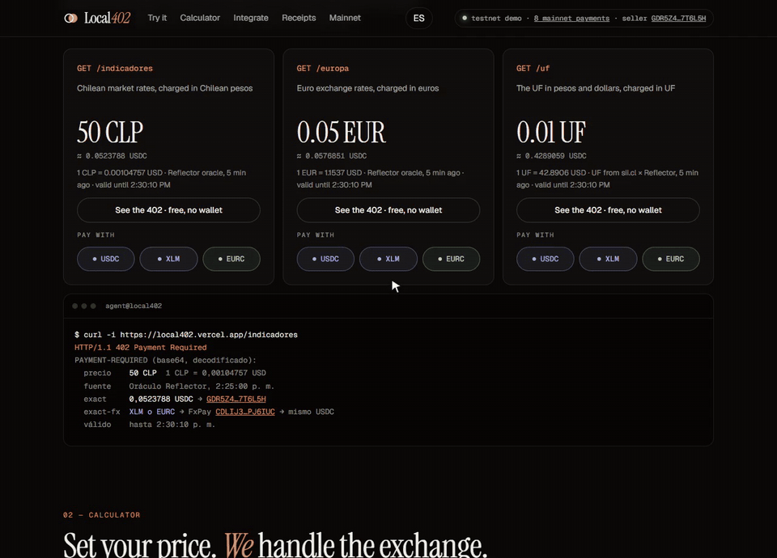
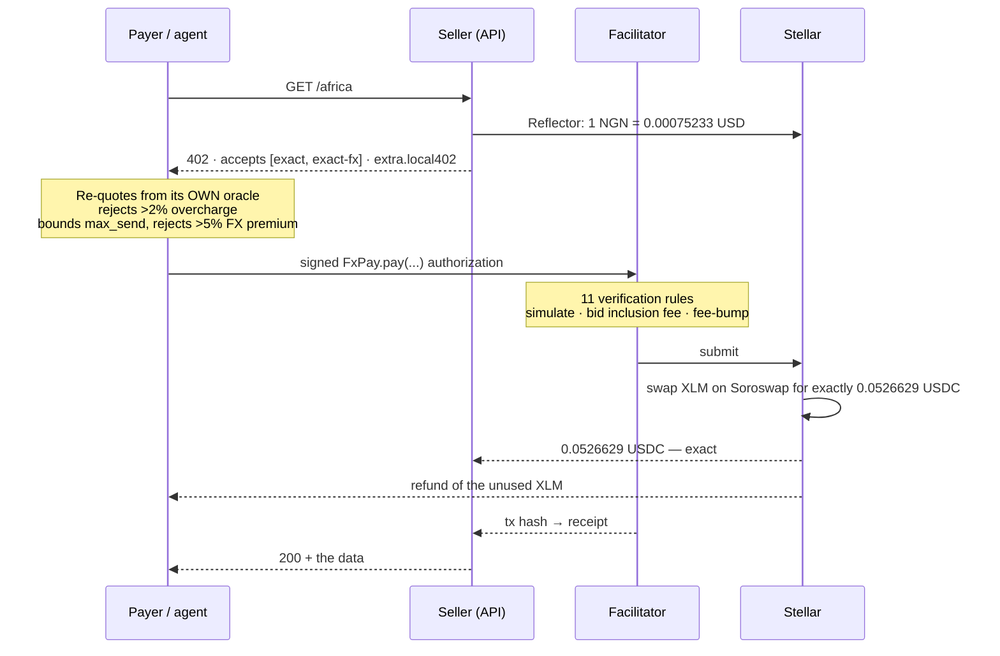

# Local402

**Charge in your currency. Receive exact USDC.**

[](https://www.npmjs.com/package/local402-server)
[](https://local402-mainnet.vercel.app)
[](https://github.com/DiegoPoveda01/local402/actions/workflows/ci.yml)
[](#testing)
[](LICENSE)

### English · [Español](README.es.md)

Local402 is [x402](https://x402.org) on Stellar for the rest of the world: a seller prices an API route
in their own currency — `"1 MXN"`, `"5 INR"`, `"70 NGN"`, `"0.05 EUR"`, `"0.01 UF"` — and a payer settles it with whatever
they hold: USDC, XLM or EURC. The seller always receives the exact USDC amount, in one transaction, with
no manual currency swap on either side.



| | |
| --- | --- |
| Dashboard (testnet) | **<https://local402.vercel.app>** |
| Live API (Stellar mainnet) | **<https://local402-mainnet.vercel.app>** |
| Scheme spec | [`docs/scheme_exact_fx_stellar.md`](docs/scheme_exact_fx_stellar.md) |
| npm | [`local402-pricing`](https://www.npmjs.com/package/local402-pricing) · [`local402-fx`](https://www.npmjs.com/package/local402-fx) · [`local402-client`](https://www.npmjs.com/package/local402-client) · [`local402-server`](https://www.npmjs.com/package/local402-server) |
| FxPay on mainnet | [`CA6Z4E55YN6LZEXBQPFCWUIMUJGAV42RLHYWWZ6SNIP4E73R2I2PUGHD`](https://stellar.expert/explorer/public/contract/CA6Z4E55YN6LZEXBQPFCWUIMUJGAV42RLHYWWZ6SNIP4E73R2I2PUGHD) |
| Reproducible build | [release](https://github.com/DiegoPoveda01/local402/releases/tag/v0.1.1_contracts_fx-pay_cli27.0.0) — wasm `69a12d89…`, byte for byte what is deployed ([why no badge](#reproducible-builds)) |
| Bug found and fixed upstream | [x402#3491](https://github.com/x402-foundation/x402/issues/3491) — mainnet rejects the fee the SDK bids; our fix, [x402#3503](https://github.com/x402-foundation/x402/pull/3503), is merged |

---

## The problem

x402 lets an HTTP resource charge per request and lets an AI agent pay on its own. Today, though, the
price is a dollar amount settled in a single asset. Write `price: "70 NGN"` and the SDK fails.

That is not how commerce outside the US works. A Mexican API bills in pesos, an Indian one in rupees, a
Nigerian one in naira; a Chilean rental contract is denominated in **UF**, an inflation-indexed unit that
changes daily. And the customer pays with whatever is in their wallet, which is usually not the seller's
asset.

### Where it works today

Local402 prices in any currency the [Reflector](https://reflector.network) fiat oracle publishes on
mainnet (checked 2026-09-16), plus USD and the UF:

| Region | Currencies |
| --- | --- |
| Latin America | MXN, BRL, COP, PEN, ARS, CLP, CRC, VES |
| Africa | NGN, KES, ZAR, CDF |
| Asia | INR, JPY, CNY, KRW, PHP, HKD |
| Europe and North America | EUR, GBP, TRY, RUB, CAD |

A new currency needs no code: the day Reflector publishes it, `localRoute("… XYZ")` prices in it. The
demo sells one route per region (`/latam` in MXN, `/asia` in INR, `/africa` in NGN) next to the euro and
Chilean ones. Chile is the deepest example because of the UF, which shows that even an indexed unit
that is not a currency works the same way.

## What Local402 adds

Two independent layers. Either one is useful on its own.

**1. Local-currency pricing (`local402-pricing`, `local402-server`).**
The price stays in the seller's currency. The [Reflector](https://reflector.network) on-chain oracle
converts it to USDC at request time, rounding **up** so the seller never receives less than the local
price. The quote travels inside the standard `402` response as `extra.local402`, and the requirement
itself is a plain `exact` USDC requirement — **any existing Stellar x402 client pays it unchanged.**

```ts
import { paymentMiddleware } from "@x402/express";
import { localRoute, local402Server } from "local402-server";

app.use(paymentMiddleware(
  { "GET /africa": localRoute("70 NGN", { payTo: SELLER_ADDRESS }) },
  local402Server(FACILITATOR_URL),
));
```

**2. `exact-fx`: pay with a different asset (`local402-fx`, `contracts/fx-pay`).**
A new x402 scheme. The payer signs a call to the **FxPay** Soroban contract, which swaps their XLM or
EURC on [Soroswap](https://soroswap.finance) for *exactly* the USDC the seller asked for, delivers it,
and refunds the unused input — all atomically. If the swap cannot deliver the exact amount within the
payer's limit, the whole transaction reverts and nothing moves.

The seller never touches XLM. The facilitator pays the network fee. The payer signs once.

## Where you'd use it

Every case below runs on the code in this repository, not on a roadmap.

- **A metered API priced in your own market.** You quote `70 NGN` or `50 CLP`; the
  buyer is charged that, and you receive USDC. You never publish a dollar figure and
  never carry the exchange rate on your pricing page — `local402-server` is a one-liner
  over any x402 route.
- **Agents paying agents.** The MCP server exposes each route as a tool; an agent reads
  the `402`, quotes it against its own oracle, and pays per call with whatever asset it
  holds. No subscription, no account, no human in the loop.
- **Pay-per-request instead of a plan.** A settled payment costs about 0.0024 XLM in
  network fee (measured, below). That makes a single API call, a single article, or a
  single inference worth charging for on its own.
- **Letting the payer bring their own asset.** With `exact-fx` the buyer pays in XLM or
  EURC and you still receive the exact USDC you asked for — the swap and the refund happen
  inside the payment. One less "first, go get USDC" step between the buyer and the sale.
- **Billing in a unit that isn't a currency.** UF is wired the same way as a fiat code, so
  a rent or an inflation-indexed contract can be priced in the unit it's actually written in.
- **Books that reconcile themselves.** Every sale leaves a receipt with the local price, the
  rate and its source, the swap premium in basis points, and the transaction hash.
  `GET /receipts.csv` hands accounting a ledger, not a screenshot.

## Try it in 60 seconds

No install, no wallet, no key. Ask the mainnet API for something and read what it answers:

```bash
# The 402 itself: the price is in naira, the requirement is in USDC
curl -si https://local402-mainnet.vercel.app/africa \
  | grep -i '^payment-required' | cut -d' ' -f2 | tr -d '\r' | base64 -d

# The same through the published client, which re-derives the price from its own oracle
npx -y local402-client quote https://local402-mainnet.vercel.app/africa
npx -y local402-client quote https://local402-mainnet.vercel.app/asia --with XLM
npx -y local402-client quote https://local402-mainnet.vercel.app/uf --with EURC
```

To pay for real, use the Freighter button in section 08 of the [dashboard](https://local402.vercel.app), or
`STELLAR_SECRET=S… npx -y local402-client pay <url> --with XLM --max "100 NGN"`. The `--max` limit can be
in any supported currency, whatever the seller's, and the client refuses anything above it.

## Quick start

```bash
npm install
npm run demo        # creates + funds throwaway testnet accounts, starts everything
```

Then open <http://localhost:3001>. The first run writes `.demo-keys.local` (gitignored); nothing else
is needed — no faucet visit, no configuration.

To run the pieces separately, copy each `.env.example` and:

```bash
npm run facilitator   # :4022  settles exact and exact-fx, pays fees
npm run api           # :3001  demo seller + dashboard
npm run agent         #        a paying client
npm run mcp           #        MCP server: an agent discovers, quotes and pays
```

## How a payment works



## Measured, not estimated

Eleven real payments on Stellar mainnet between 15 and 20 September 2026, all of them successful. The last
three went through the reproducible-build deployment. The latest ones are
in the [receipts](https://local402-mainnet.vercel.app/receipts).

| | |
| --- | --- |
| What the seller received | The exact USDC amount the 402 asked for, in all eleven payments. |
| Network fee, paid by the facilitator | 0.0024 XLM for a USDC payment. For `exact-fx`, 0.081 and 0.044 XLM on a fresh deployment's first two swaps, then about 0.0055 once the contract's ledger entries are warm. Redeploying reproduced this exactly: 0.0807 and 0.0436. |
| What the swap actually spent | 0.21–0.39% above the Reflector value of the price (the three payments on 15 September). |
| The most the payer authorized | 2.29–3.17% above it. That includes the 2% slippage allowance, and whatever the swap does not use is refunded. |
| A 402 carrying a live quote | About 0.41 s, warm. |
| A full payment on testnet: 402 → quote → sign → settle → 200 | 5.6 s with XLM, 6.8 s with USDC, 9.4 s with EURC (which routes through XLM). |

## Repository map

```
packages/
  pricing/   local currency → USDC.  Reflector oracle, UF source, x402 DynamicPrice
  fx/        the exact-fx scheme: client, resource server, facilitator, fee bidding
  client/    Local402Client — pays with USDC/XLM/EURC, with its own guards. Also a CLI
  server/    localRoute() and localToolPayment() — one line to price a route or an MCP tool
apps/
  demo-api/      the seller: six paid routes, receipts, the dashboard
  facilitator/   verifies and settles, pays fees, serves the x402 Bazaar catalog
  agent/         minimal paying client
  mcp/           MCP server an AI agent uses to discover, quote and pay
  mcp-seller/    an MCP server whose tool is itself paid per call
contracts/
  fx-pay/        the Soroban contract, in Rust, with its tests
docs/
  scheme_exact_fx_stellar.md   the exact-fx spec, in the x402 spec format
```

## Design decisions worth reading

These are the places where the obvious implementation is wrong.

**Rounding is directional.** `quoteLocalPrice` rounds *up* (`ceilDiv`). A seller asking 70 NGN must
never receive 69.999 NGN worth of USDC because of integer truncation.

**Quotes are median-of-five, not last-price.** Reflector's CLP feed has published single 5-minute
prints 0.65% away from their neighbours. `ReflectorFiatOracle` takes the median of the last five
records, so one outlier tick cannot set a price. Stale rates (>15 min by default) are rejected
outright. When the feed skipped periods, the history is cut at the gap first (`recentRun`): those five
records would otherwise span hours while still reporting the newest timestamp, and the median would
smooth in prices that are no longer relevant. A price backed by a single record says so, with a
`#single` suffix on its source — that is one raw print, exactly the tick the median exists to absorb.

**Quotes are HMAC-signed and frozen.** x402 rebuilds the payment requirements when the paid retry
arrives — and the oracle may have moved in between, which would make the amount the payer signed no
longer match. `localPrice` signs the quote it issued; any server instance holding the same secret
honours it while it is valid. This is what makes the flow correct behind a load balancer, not just on
one process.

**The client re-derives the price instead of trusting it.** `Local402Client` quotes the same local
price from its own oracle and refuses a quote more than 2% above it (`maxOverchargeBps`), and refuses
an FX payment whose `max_send` is more than 5% above the oracle value of the price
(`maxFxPremiumBps`). The FxPay contract address is pinned client-side and never taken from the
server's response — a malicious contract could spend up to `max_send`.

Be precise about what that buys: by default both sides read the *same* Reflector feed, so this catches
a seller who misquotes, not a feed that is wrong. Pass your own `oracle` to `Local402Client` for an
independent reading. The UF adds a second shared dependency — the SII, or its two mirrors — and a
stale UF is why a quote also carries `oracleValueDate`: the day the value is actually from, which the
CLP timestamp cannot tell you.

**The agent's budget is reserved, not checked.** `SpendingBudget` is debited *before* the request and
credited back on failure, so two concurrent payments cannot both pass a check-then-spend test and
together overrun the limit.

**The facilitator has eleven verification rules, and two are redundant on purpose.** The authorization
tree (rule 7) already bounds what the payer's signature permits. Rules 9 and 10 re-check the *simulated
events* — that the seller was paid, and that no facilitator account was drained — as defence in depth.
Since the facilitator pays the fees, a public deployment can also require an allowlisted seller and a
minimum amount, and rate-limits `verify`/`settle` separately because they cost different things.

**Fee bidding, and a bug we fixed upstream.** `@x402/stellar` 2.25 always bids the 100-stroop base
fee, which mainnet frequently rejects under Soroban surge pricing. `feeBumpSigner` re-wraps the fee
bump with a bid of twice the network's recent p99, capped — without touching the inner transaction or
its signatures. We reported it as [x402#3491](https://github.com/x402-foundation/x402/issues/3491) and
fixed it in [x402#3503](https://github.com/x402-foundation/x402/pull/3503), merged into x402 `main`: the
exact facilitator now takes an `inclusionFeeStroops` option. The workaround stays until a release
(after 2.26.0) ships it.

**Parallel settlement needs separate accounts.** Two settlements from one Stellar account collide on
the sequence number. `ChannelPool` hands each concurrent settlement its own fee-paying account, and
queues the rest until one is free. It is an in-process lock, so it only separates settlements running
in the *same* facilitator instance: two instances sharing one key still collide. That is why `/settle`
retries once on a `submission_failed` that never reached the ledger, and why a horizontally scaled
facilitator needs a disjoint `FACILITATOR_PRIVATE_KEYS` per instance.

**The UF is a date, not a rate.** It is defined per calendar day in Chile's timezone. `UfRateSource`
reads the SII (the tax service), falls back to two other sources, times out at 4 s and keeps the last
known value for up to three days — because an API that returns 402 with no price is worse than one
priced on yesterday's UF.

**A paid resource is never cached.** Both the client probe and the API send `no-store`. A cached 200
would hand out a paid response for free; a cached 402 would hand out an expired quote.

## When something goes wrong

Each of these fails before any money moves, or reverts the whole transaction. The facilitator codes below
drop their `invalid_exact_fx_payload_` prefix.

| Situation | What happens |
| --- | --- |
| The oracle rate is more than 15 minutes old, dated in the future, or zero | The server refuses to quote. No requirement is issued, so nobody pays on a bad price. |
| The seller quotes more than 2% above the payer's own oracle | `Local402Client` refuses before signing. |
| The swap could spend more than 5% above the oracle value | The client refuses before signing (`maxFxPremiumBps`). |
| The payer does not hold `max_send` | The client says how much has to be available and how much is there, before the wallet opens. |
| The pools moved and the route now needs more than `max_send` | FxPay reverts with `ExcessiveInput`. Nothing moves. |
| No pool can deliver the seller's asset | FxPay fails with `NoRoute`, a readable error rather than a trap. |
| The amount, recipient or asset differs from the 402 | The facilitator rejects it: `wrong_amount`, `wrong_recipient`, `wrong_asset`. |
| The signature authorizes anything beyond `pay` and one transfer | `wrong_auth_root`, `wrong_auth_subinvocation` or `unexpected_auth_entries`. |
| The transaction would move the facilitator's own funds | `moves_facilitator_funds`, checked against the simulated events. |
| The deadline passes while the payer approves in the wallet | `deadline_expired`. The client already allows 180 s of signing time. |
| Two settlements race for one account | `ChannelPool` gives each its own. A submission that never reached the ledger is retried once. |
| All three UF sources are down | The last known UF is used for up to three days. After that only the UF route stops quoting; the others keep working. |

## Deploying it somewhere real

`npm run demo` needs nothing. A deployment that more than one process serves, or that spends real
money, needs these — each `.env.example` lists the rest.

| Variable | Where | Why it matters |
| --- | --- | --- |
| `LOCAL402_QUOTE_SECRET` | seller | Signs quotes. Without it, a paid retry that lands on another instance re-quotes and rejects a payment the payer already signed. Same value on every instance. The server logs a warning when it is missing. |
| `KV_REST_API_URL`, `KV_REST_API_TOKEN` | seller | Receipts, the demo payment caps and the last known UF value. Without them each serverless instance keeps its own, and they disappear when it does. |
| `SELF_URL` | seller | Where the demo agent buys from. Falls back to the Vercel project's production domain, and to the request's `Host` only when that is localhost, because `Host` is whatever the caller wrote. |
| `CORS_ORIGIN` | seller | Dashboard origins allowed to pay from the visitor's wallet, comma-separated. |
| `PAY_TO_ALLOWLIST`, `MIN_AMOUNT` | facilitator | Every settlement spends the facilitator's own fees. On `stellar:pubnet` these default to `PAY_TO` and 100000 (0.01 USDC); set them explicitly to serve other sellers. |
| `FACILITATOR_PRIVATE_KEYS` | facilitator | One key per concurrent settlement. `ChannelPool` separates them within an instance only, so give each instance its own keys. |
| `FX_CONTRACT` | both | Required on mainnet: the FxPay deployment the payer's authorization is pinned to. |

## Testing

```bash
npm test        # 41 unit tests across pricing, fx and client
npm run typecheck
cd contracts && cargo test    # 10 contract tests against a mock Soroswap router
```

The contract tests cover the cases that matter: exact delivery with a refund of the unused input,
`quote` agreeing with what `pay` actually spends, rejection when the route needs more than `max_send`,
routing through the hub asset when there is no direct pool, picking the cheaper of two routes, and
refusal without the payer's authorization. Two cover a router that answers with no amounts at all: the
hub route still wins if it exists, and otherwise the payer gets `NoRoute` rather than a trap.

Nine TypeScript tests drive the facilitator's verification offline, over every rejection it reaches before
it touches the network: a payload for another version, scheme or network, a transaction it cannot read, a
call that is not FxPay's `pay`, a source or payer that is the facilitator itself, a send asset it does not
accept, an asset, amount or recipient that is not what the seller asked for, and a deadline that has
expired or reaches too far.

Four further tests build a real `exact-fx` payload against testnet and run it through the facilitator's
verification, including the rejections. They only run when `FX_PAYER_SECRET` is set, so a clean
checkout needs no funded account to go green.

## Reproducible builds

The contract on mainnet is not a local build someone uploaded. Its wasm is byte for byte a GitHub release
artifact, compiled in CI by [stellar-expert's reusable workflow](https://github.com/stellar-expert/soroban-build-workflow).
Check it without trusting this README:

```bash
curl -fsSL -O https://github.com/DiegoPoveda01/local402/releases/download/v0.1.1_contracts_fx-pay_cli27.0.0/fx-pay_v0.1.1.wasm
sha256sum fx-pay_v0.1.1.wasm
curl -s https://api.stellar.expert/explorer/public/contract/CA6Z4E55YN6LZEXBQPFCWUIMUJGAV42RLHYWWZ6SNIP4E73R2I2PUGHD | jq -r .wasm
```

Both print `69a12d89059be04ac195f5acf40982d7e9ee93fd08f4df33626789d00ffccbd2`. The build is reproducible in
the strict sense: two runs, from different commits and with the package version changed between them,
produced identical artifacts. Each carries a [SLSA provenance attestation](https://github.com/DiegoPoveda01/local402/attestations)
signed through Sigstore and logged in Rekor. `scripts/mainnet/deploy-fxpay.sh` deploys the downloaded
release asset and aborts if its hash is not the one above, so a local build cannot reach mainnet by accident.

stellar.expert still reports the contract as `unverified`, and that part is not ours to fix. Its intake
endpoint now answers `{}` where it used to answer `{"ok":1}`, so submissions never reach the validation
queue — reposting the payload of an already-verified contract reproduces it, which rules out anything
specific to this build. Tracked upstream in
[soroban-build-workflow#9](https://github.com/stellar-expert/soroban-build-workflow/issues/9) and
[#8](https://github.com/stellar-expert/soroban-build-workflow/issues/8), where another project's release
has sat unverified for over a month. The two hashes above are exactly the check that badge would have
automated.

## What it does not do

- **It does not make the oracle right.** By default the seller and the payer read the same Reflector feed, so
  Local402 catches a seller who misquotes, not a feed that is wrong. Pass your own `oracle` to
  `Local402Client` for an independent reading.
- **It does not hedge.** The seller receives USDC. Turning it into their local currency is still their job: Local402 fixes
  the amount of the sale, not the exchange rate after it.
- **It does not search every venue.** FxPay routes on Soroswap only, through the direct pool or through XLM.
  The SDEX quote on the dashboard is there for comparison and is never used to pay.
- **It does not hold funds.** Input sits in FxPay only inside the transaction that swaps it. The contract
  keeps no balance between payments and has no admin or upgrade function.
- **It is not audited.** The contract has 10 tests and has settled real payments, but no external audit —
  an internal review is in [docs/security-review.md](docs/security-review.md). The wasm that runs on mainnet
  was also deployed to testnet as [CD6PUDBJ…](https://stellar.expert/explorer/testnet/contract/CD6PUDBJNDYWLTQPHYU26OCEH4GWR7WN3UIXAEKUP3DQIS3DKJQIF7DL) and scanned with
  [kuyfi](https://github.com/alex0tico/kuyfi), an automated black-box fuzzer for Soroban: 37 vectors over the
  five entry points, zero findings. Every vector was rejected in simulation, so nothing reached the ledger —
  a surface scan, not an audit. That is why the mainnet facilitator only settles for the demo seller and for
  at least 0.01 USDC.
- **`exact-fx` is not part of x402 yet.** It is a draft. A stock x402 client pays the `exact` option of the
  same 402, not the FX one.

### Who trusts whom

| Party | Relies on | Protected by |
| --- | --- | --- |
| Seller | The oracle to price fairly, and the facilitator to submit. | The signed authorization fixes the amount, asset and recipient, and FxPay reverts unless it delivers that exact amount. |
| Payer | The seller's quote, within 2% of its own oracle, and an FxPay address it pinned itself. | It signs one bounded transfer (`max_send`) with a deadline, and the unused part comes back. |
| Facilitator | Nothing the payer says. | Eleven verification rules on the simulation, a refusal to act as the payer, and on mainnet an allowlisted seller and a minimum amount. |

## Status

Running on **Stellar mainnet** with real payments — USDC, XLM and EURC — through the FxPay deployment
linked above. Every sale leaves a receipt recording the local price, the rate and its source, the swap
premium in basis points, and the transaction hash. `GET /receipts.csv` hands it to accounting.

`exact-fx` is a draft scheme. It is written in the x402 spec format so it can be discussed as a
proposal, and it could equally be expressed as an `assetTransferMethod` of `exact`; what does not
change either way is the seller-facing guarantee and the facilitator's verification rules.

## License

MIT — see [LICENSE](LICENSE).
